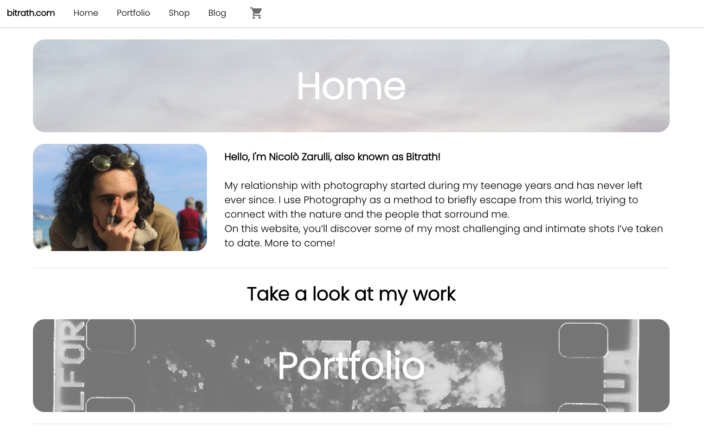
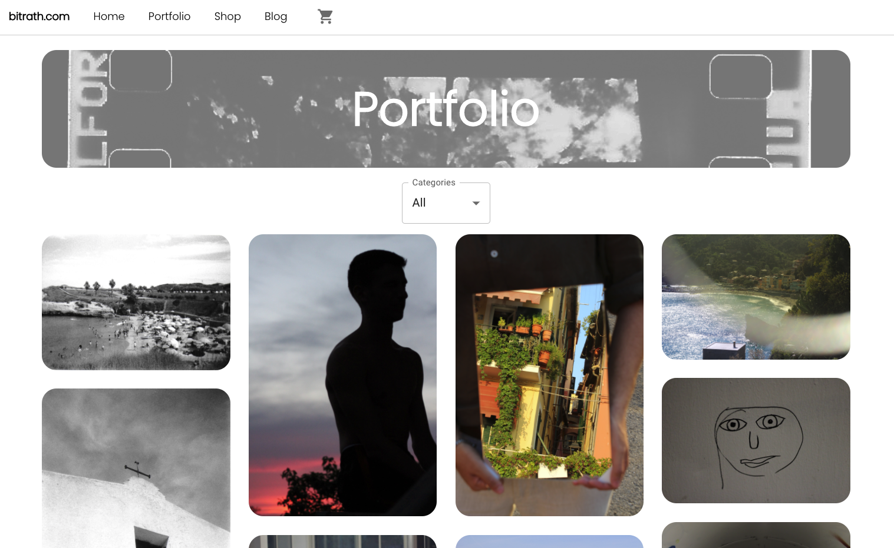
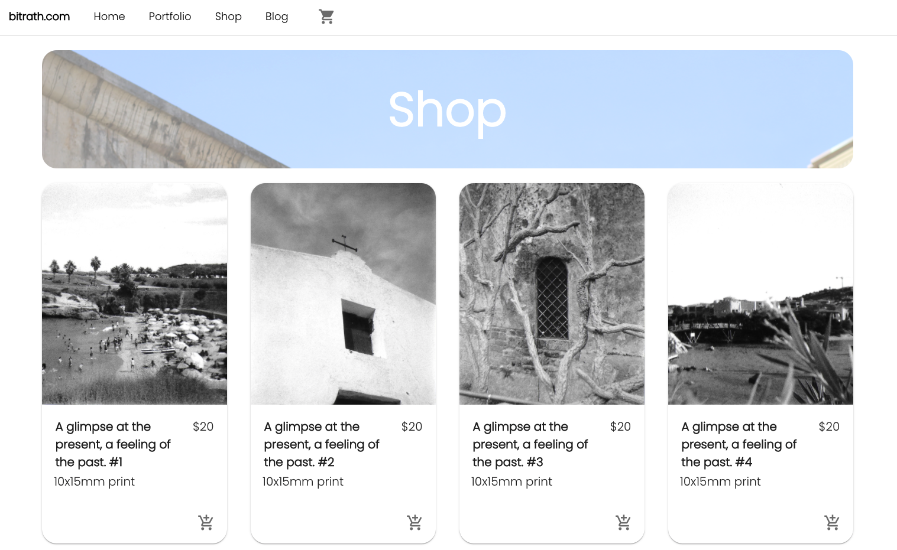
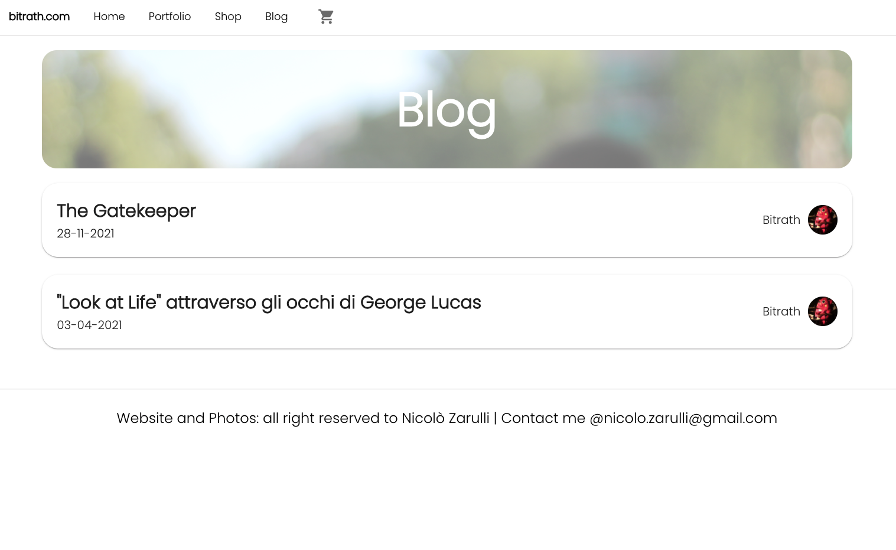

# bitrath.com

## What is `bitrath.com` ?

The idea of `bitrath.com` was born as a course project at my Computer Engineering BoS Degree at University Of Parma.

The concept behind it is very simple: my goal was to provide a full-stack website template aimed to the demographic of the Artists, like Photographers, Painters, etc...

These assumptions naturally led to a very basic scruture of the main components of this website into three categories:

- Portfolio
- Shop
- Blog

Being an amateur photographer myself, I decided to structure the entire project as my personal website. Therefore I had to exclude from the git repository every photo, due to copyright reasons.

Nontheless, you can implement your personal photos and data to make your own `bitrath.com`.

### bitrath.com/home



## Frontend

The frontend, also know as the Client Process of this project, is built upon `ReactJS`.

Some of the graphical components used are featured from the `MaterialUI` graphical framework, which lets you import dynamic and reactive components, that also make a Mobile View implementation more accesible.
I've also used `Framer-Motion` to implement a simple transition animation onto the Modal components.

The frontend communicates, retrieves and sends data to the backend thanks to AJAX. This is achieved with `Redux` and `Axios` libraries. The first one lets me manage and centralize the application state inside a 'store' box; the latter lets the store make simple HTTP Requests to the Server.

Next up, there are a couple of screenshots to show how the Client looks like.

### bitrath.com/portfolio



### bitrath.com/shop



### bitrath.com/blog



## Backend

The Backend, also known as the Server Process, is built upon `express.js` & `mongoose`.
It handles all of the data retrieval requests from the Client.
It also has a built in script to import personalized data into a MongoDB Cluster, connected to the project via an URI.

## How do I Install my version of `bitrath.com`?

Copyright wise, I had to exclude from this public repository my personal pictures. Therefore, what you can observe through the screenshots, is an idea of the capabilities the websites possesses.

I also excluded the .ENV file, in which are sited sensible global variables, such as:

- PORT: at which che Server will serve.
- MONGODB URI: a personal URI that is needed to connect a MongoDB Cluster to this project.

What you have to do is:

- Clone this repository, or download it as a ZIP file.
- Create a MongoDB Cluster, via Atlas or Locally.
- Create a .ENV file into the main folder, into which you'll declare the two global variables, based upon your sensible choices.
- Install NodeJS dependencies
  ```
  npm init -y
  ```

You should be all set-up!

You can modify the data objects with your own personalized data.
To import it into your MongoDB Cluster, just run the `populateDatabase.js` script.

To run the processes concurrently, I have set up for you a basic script. Do as it follows from your terminal, when into the main folder:

```
   npm run dev
```

If you still have problems, consider to manually install all of the modules needed for the frontend & backend:

```
cd frontend
npx create-react-app .
npm i axios @mui/material @mui/lab framer-motion redux  redux-thunk react-redux react-router-dom@5.3.0
```

```
cd backend
npm i express mongoose dotenv
```
